## 2.1 应用层协议原理
1、应用程序体系结构：**客户-服务器体系结构**、**P2P体系结构**

2、客户-服务器体系结构一个特征是服务器具有固定的、周知的地址，即IP地址

3、一个进程可以被认为是运行在端系统的一个程序，不同端系统上的进程通过交换**报文**通信

4、在一对进程之间的通信会话场景中，发起通信的进程被标识为客户，会话开始时等待联系的进程是服务器

5、P2P下一个进程既是客户又是服务器

6、进程通过一个称为**套接字**的软件接口向网络发送报文和从网络接收报文，套接字是应用程序进程与传输层协议中间的“门”

7、套接字也称为应用程序和网络之间的**应用程序编程接口（API）**

8、进程寻址：

>①主机的地址（IP）
>②目的主机指定接收进程，或更准确的说，接收套接字（端口号）

9、安全套接字SSL，不是与TCP、UDP相同层级的第三种传输层协议，而是一种TCP的加强，强化是在**应用层**上实现的（TCP、UDP到传输层再展开）

2.2 Web和HTTP
--------------
10、HTTP由两个程序实现：客户端程序和服务器程序，两者运行在不同的端系统中，通过HTTP报文进行会话。

11、每个请求/响应对经一个单独的TCP连接发送 -> **非持续性连接**，反之则为**持续性连接**

12、非持续性连接**缺点**：
>1. 必须为每一个请求的对象建立和维护一个全新的连接
>2. 每一个对象经受两倍RTT（往返时间）的交付时延，一个用于创建TCP，另一个用于请求和接收对象

13、HTTP 1.1实现单个TCP连接进行多次请求

14、HTTP 2实现同域名下所有通信都在单个连接上完成，该连接可以承载任意数量的双向数据流，且多个请求和回答可以交错（**并行全双工**）

15、
**请求报文**：请求行+首部行+空行+实体体

>  

​               

> ​     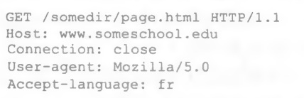                                                                                                                                                                                                                                                                                                                                                                    

**响应报文**：状态行+首部行+空行+实体体

> 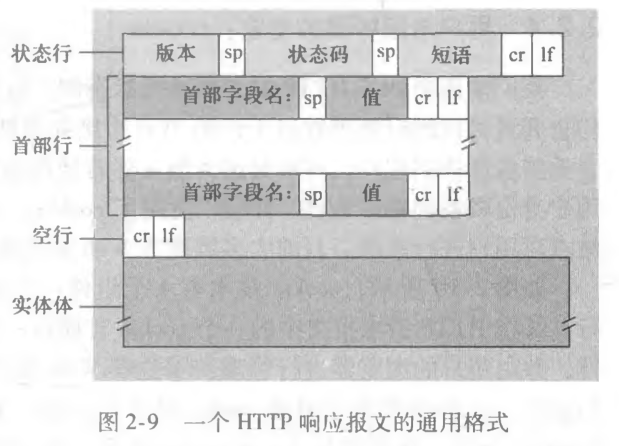

> 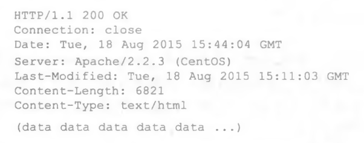

16、cookie设置在首部行，且保存在客户端系统

17、Web缓存器（代理服务器）：既是服务器又是客户

**作用**：

>1.大大减少对客户请求的响应时间
>2.大大减少一个机构的接入链路到因特网的通信量

18、**条件GET**： 允许缓存器证实它的对象是最新的，防止存放的副本过时

使用方法： ①请求报文使用 GET方法 ，②请求报文中包含一个 “ If-Modified-Since ： ” 首部行 。

304 Not Modified就是条件GET后得到的响应与缓存器中副本一致，未被更改

## 2.3  电子邮件

19、电子邮件系统：用户代理、邮件服务器、**简单邮件传输协议（SMTP）**。***邮件服务器*** 形成了电子邮件体系结构的核心，邮箱建立在邮件服务器上

20、 **SMTP 一般不使用中间邮件服务器发送邮件** ， 即使这两个邮件服务器位于地球的两端也是这样 。

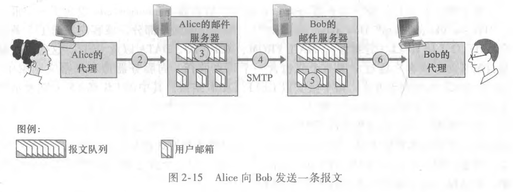

上述Alice的发送报文队列中的报文如果尝试多次发送后仍不能交付给Bob的服务器，那么Alice服务器就会删除该报文并通知发送方Alice

21、SMTP与HTTP区别：

（1） HTTP 主要是一个**拉协议 （ pull protocol ）**， 用户使用 HTTP 从该服务器拉取信息， TCP 连接是由想接收文件的机器发起的。 SMTP 基本上是一个**推协议 （ push protocol ）** , 即发送邮件服务器把文件推向接收邮件服务器 ，此时 这个 TCP连接是由要发送该文件的机器发起的。

（2） SMTP 要求每个报文 （ 包括它们的体 ） 采用 7 比特 ASCII 码格式 ，HTTP不受这种限制

（3）处理一个既包含文本又包含图形 （ 也可能是其他媒体类型 ） 的文档时， HTTP 把每个对象封装到它自己的 HTTP 响应报文中，而 SMTP 则把所有报文对象放在一个报文之中 

22、由于SMTP是一个推协议，用户要从服务器上取报文就需要邮件访问协议的支持：

* 第三版的邮局协议（POP3）
* 因特网邮件访问协议（IMAP）
* HTTP

23、POP3按三个阶段工作：特许、事务处理以及更新

* 特许阶段： 用户代理发送 （ 以明文形式 ） 用户名和口令以**鉴别**用户
* 事务处理阶段：用户代理**取回报文** ， 同时在这个阶段用户代理还能进行以下操作：对报文做删除标记 ， 取消报文删除标记 ， 以及获取邮件的统计信息 。
* 更新阶段：出现在客户发出了 quit 命令之后 ，目的是结束该 POP3 会话，这时 ， 该邮件服务器**删除那些被标记为删除的报文** 

24、POP3事务处理阶段，用户代理通常为**“下载并删除”**或者**“下载并保留”**，下载并删除的一个问题是不能从多个机器上访问邮件报文。 POP3 服务器并**不**在 POP3 会话过程中**携带状态信息**，大大简化了 POP3 服务的实现。

25、IMAP能够在远程服务器上构建层次文件夹并将报文存放在服务器中，另外， 与 POP3 不同 ， IMAP 服务器**维护了 IMAP 会话的用户状态信息**

26、基于Web的电子邮件， **用户代理就是普通的浏览器** ， 用户和他远程邮箱之间的通信则通过 **HTTP** 进行。也就是说，用户从邮箱中获取一个报文时 ， 该报文**从邮件服务器发送到浏览器**使用的是 HTTP 而不是 POP3 或者 IMAP 协议 。 当发件人  要发送一封电子邮件报文时 ， 该电子邮件报文**从发件人的浏览器发送到他的邮件服务器** 时， 使用的是 HTTP而不是 SMTP 。当然，**邮件服务器之间发送和接收邮件时** ， 仍然使用的是 SMTP 。

## 2.4 DNS：因特网的目录服务

27、识别主机的两种方式：**主机名**和**IP地址**

28、**域名系统（DNS）**：主机名到 IP 地址转换的目录服务，C/S架构。

* 一个由分层的 DNS 服务器 （ DNS server ） 实现的分布式数据库 
* 一个使得主机能够查询分布式数据库的应用层协议

29、注意，**DNS运行在UDP之上**，53号端口

30、访问一个网页的过程（以`www.someschool.edu`为例）

1 ） 同一台用户主机上运行着 DNS 应用的客户端 。
2 ） 浏览器从上述 URL 中抽取岀主机名 `www.someschool.edu`, 并将这台主机名传给DNS 应用的客户端 。
3 ） DNS 客户向 DNS 服务器发送一个包含主机名的请求 。
4 ） DNS 客户最终会收到一份回答报文 ， 其中含有对应于该主机名的 IP 地址 。
5 ） 一旦浏览器接收到来自 DNS 的该 IP 地址 ， 它能够向位于该 IP 地址 80 端口的HTTP 服务器进程发起一个 TCP 连接 

31、DNS其他重要服务：

* 主机别名
* 邮件服务器别名
* 负载分配： 繁忙的站点被冗余分布在多台服务器上,每台服务器均运行在不同的端系统上 ， 每个都有着不同的 IP 地址 。 由于这些冗余的 Web 服务器 ， **一个 IP 地址集合因此与同一个规范主机名相联系** 。 DNS 数据库中存储着这些 IP 地址集合 。 当客户对映射到某地址集合的名字发出一个 DNS 请求时 ， 该服务器用 IP 地址的整个集合进行响应 ， 但在**每个回答中循环这些地址次序** 。 因为客户通常总是向 IP 地址排在**最前面的服务器**发送 HTTP 请求报文 ， 所以DNS 就在所有这些冗余的 Web 服务器之间**循环分配了负载**

32、DNS 的一种简单设计是在因特网上只使用一个 DNS 服务器 ， 该服务器包含所有的映射 ，但不适用于当今的因特网，主要问题如下：

1）**单点故障**：该 DNS 服务器崩溃 ， 整个因特网随之瘫痪 

2）**通信容量**：处理所有的 DNS 査询，负载大

3）**远距离的集中式数据库**：远距离DNS查询将导致严重时延

4）**维护**：困难

33、DNS是一个**分布式数据库**：以层次方式组织 ， 并且分布在全世界范围内

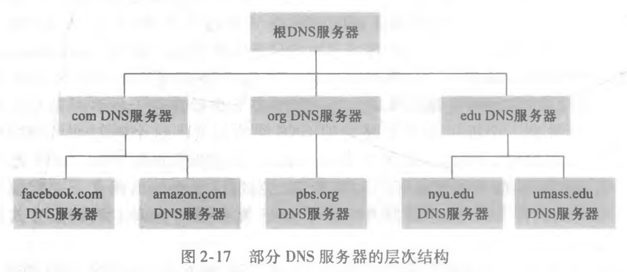

 3 种类型的 DNS 服务器 ： ***根 DNS服务器*** 、 ***顶级域 ( Top -Level Domain , TLD) DNS 服务器*** 和***权威 DNS 服务器***

假定一个 DNS 客户要决定主机名 www. amazon.com 的 IP 地址，粗略说，客户首先与**根服务器之一联系** ， 它将返回**顶级域名 com 的 TLD 服务器的 IP地址** 。 该客户则与**这些 TLD 服务器之一联系** ， 它将为 **amazon.com 返回权威服务器的 IP地址** 。 最后 ， 该客户与 **amazon.com 权威服务器之一联系** ， 它为主机名 www. amazon.com返回其 IP 地址 

34、**本地DNS服务器**（可用于缓存，减少流量）

> 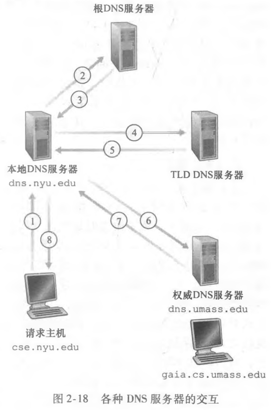

> 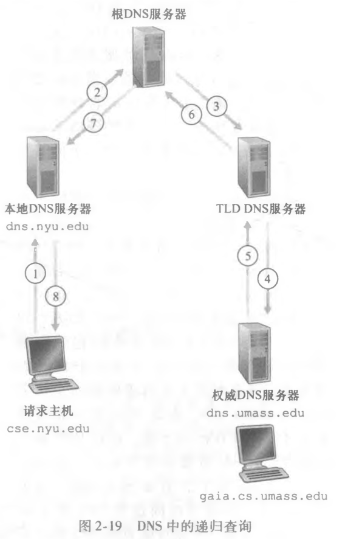

图2-18从请求主机到本地DNS服务器是**递归查询**，其余是**迭代查询**，图2-19是递归查询，实践中一般遵循2-18模式

35、 事实上 ， 因为缓存 ， 除了少数 DNS 查询以外 ，大部分查询链中的**根服务器被绕过了** 

36、所有分布式DNS服务器都存储了资源记录（RR），其**提供主机名到IP地址的映射**

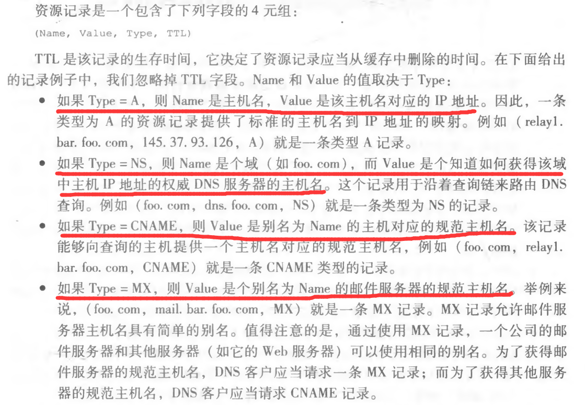

​        如果一台 DNS 服务器是用于某特定主机名的权威 DNS 服务器 ， 那么该 DNS 服务器会**有一条包含用于该主机名的类型 A 记录(即使该 DNS 服务器不是其权威 DNS 服务器** ， 它也可能在缓存中包含有一条类型 A 记录) 。 如果服务器不是用于某主机名的权威服务器,那么该服务器将**包含一条类型 NS 记录** ， 该记录对应于包含主机名的域 ； **它还将包括一条类型 A 记录** ， 该记录**提供了在 NS 记录的 Value 字段中的 DNS 服务器的 IP 地址**

37、DNS只有两种报文：查询和回答报文，且**格式一致**

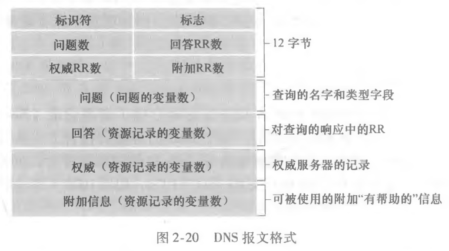

* 首部区域：
  * 第一个字段 （ **标识符** ） 是一个 **16 比特**的数 ， 用于标识该查询 。
  *  1 比特的 **“ 查询 / 回答 ” 标志位**指出报文是查询报文 （ 0 ） 还是回答报文 （ 1 ）
  *  1 比特的 “ 权威DNS ” 标志位， 指明当前DNS服务器是否为所请求名字的权威 DNS 服务器
  *  4 个有关数量的字段 ， 这些字段指出了在**首部后的 4 类数据区域出现的数量** 
* 问题区域包含着**正在进行**的查询信息
*  回答区域包含了对最初请求的名字的资源记录
*  权威区域包含了其他权威服务器的记录
*  附加区域包含了其他有帮助的记录

38、注册登记机构：验证域名的唯一性 ， 将该域名输入 DNS 数据库 ， 对提供的服务收取少量费用 （也就是购买域名）

注册时， 需要向该机构提供你的**基本和辅助权威 DNS 服务器**的名字和 IP 地址， 该注册登记机构确保将一个类型 NS 和一个类型 A 的

记录输入相应的**TLD服务器**

## 2.5 P2P文件分发

39、对于C/S架构，分发时间随着对等方 N 的数量**线性地增加并且没有上界**； P2P 体系结构,最小分发时间不仅**总是小于**C/S体系结构的分发时间，且有界

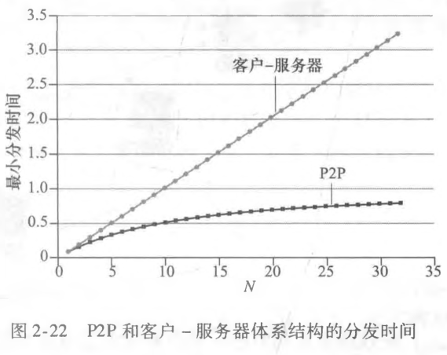

 具有 P2P 体系结构的应用程序能是**自扩展**的 。 这种扩展性的直接成因是:**对等方除了是比特的消费者外还是它们的重新分发者**

40、BitTorrent 是一种用于文件分发的流行 P2P 协议。 参与一个特定文件分发的**所有对等方的集合**被称为一个**洪流 （ torrent ）** 。 在一个洪流中的对等方彼此下载等长度的文件块 （ chunk），典型的块长度为 256 KB。 当一个对等方首次加入一个洪流时 ， 它没有块 。 随着时间的流逝 ， 它累积了越来越多的块 。 当它下载块时 ， 也为其他对等方上载了多个块 。 一旦某对等方获得了整个文件 ， 它也许 （ 自私地 ） 离开洪流 ， 或 （ 大公无私地 ） 留在该洪流中并继续向其他对等方上载块 。 同时 ， 任何对等方可能在任何时候仅具有块的子集就离开该洪流 ， 并在以后重新加入该洪流中 。（也就是种子文件的下载分享方式）

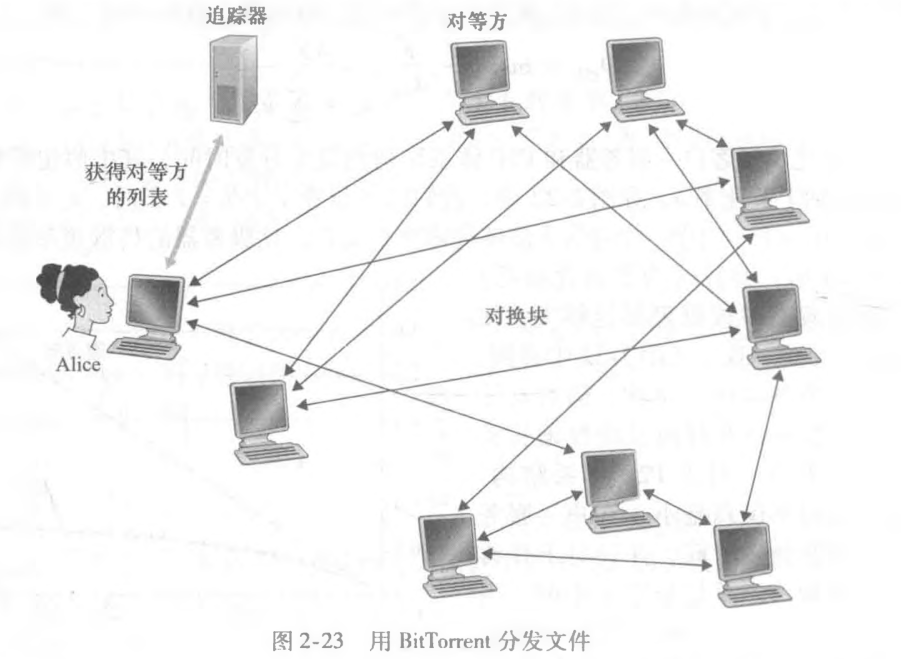

41、决定请求哪些块的过程中 ，将使用一种称为**最稀缺优先** （ rarest first ） 的技术。 这种技术的思路是 ， 针对她没有的块在她的邻居

中决定最稀缺的块 （ 最稀缺的块就是那些在她的邻居中副本数量最少的块 ） ， 并**首先请求那些最稀缺的块** 。 这样 ， 最稀缺块得到更

为迅速的重新分发 ， **其目标是 （ 大致地 ） 均衡每个块在洪流中的副本数量**。

## 2.6 视频流和内容分发网

42、在 HTTP 流中 ， 视频只是存储在 HTTP 服务器中作为一个普通的文件 ， 每个文件有一个特定的 URL。

43、经 HTTP 的动态适应性流 ( Dynamic Adaptive Streaming over HTTP, DASH ) ： 允许客户使用不同的以太网接入速率流式播放具有不同编码速率的视频，（**通俗说也就是网好时蓝光画质，网差时360P**）

44、为了**应对向分布于全世界的用户分发巨量视频数据的挑战** ， 几乎所有主要的视频流公司都利用**内容分发网** （ Content Distribution Network , CDN），CDN 管理分布在多个地理位置上的服务器，将每个用户请求**定向到一个将提供最好的用户体验的 CDN 位置**。分为专用CDN和第三方CDN

45、CDN 通常采用两种不同的服务器安置原则：

*  **深入**，通过在遍及全球的接入 ISP 中部署服务器集群来深入到 ISP 的接入网中，目标是靠近端用户，减少端用户和CDN 集群之间 （ 内容从这里收到 ） 链路和路由器的数量 ， 从而**改善了用户感受的时延和吞吐量** 。 因为这种高度分布式设计 ， 维护和管理集群的任务成为挑战
* **邀请做客**，通过在少量 （ 例如 10 个 ） 关键位置建造大集群来邀请到 ISP 做客，将集群放置在因特网交换点 （ 1XP ），邀请做客设计通常**产生较低的维护和管理开销** ， 可能以对端用户的较高时延和较低吞吐量为代价 。

46、 假定一个内容提供商 NetCinema ，雇佣了第三方 CDN 公司 KingCDN 来向其客户分发视频，**流程**如下：

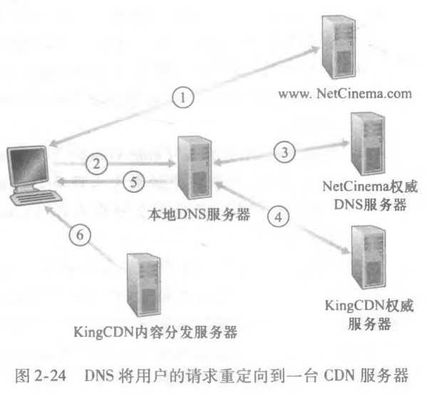

47、集群选择策略： 即动态地将客户定向到 CDN 中的某个服务器集群或数据中心的机制。

* 一种简单的策略是指派客户到**地理上**最为邻近 ( geographically closest ) 的集群，但网络路径不一定短
* 基于**当前流量条件**为客户决定最好的集群

## 2.7 套接字编程

48、 当生成一个套接字时 ， 就为它分配一个称为**端口号** ( port number) 的标识符；发送进程为分组附上目的地址，目的地址是由**目的主机的 IP 地址**和**目的地套接字的端口号**组成的

（注： 发送方的源地址也是由源主机的 IP 地址和源套接字的端口号组成 ， 该源地址也要附在分组之上 。 然而 ， 将源地址附在分组之上通常并不是由 UDP 应用程序代码所为 ， 而是**由底层操作系统自动完成的** ，故实现代码中不需要显式写出）

49、UDP套接字编程， **UDP 服务器在将分组丢进套接字之前必须为其附上一个目的地地址** ，而TCP套接字编程，由于客户和服务器能够开始互相发送数据之前 ， 它们先要握手和**创建一个 TCP 连接**， 使用创建的 TCP连接 ，客户套接字地址（ IP 地址和端口号 ） 和服务器套接字地址 （ IP 地址和端口号 ）已经关联起来，当一侧要向另一侧发送数据时 ， 它**只需经过其套接字将数据丢进 TCP 连接**。

50、在三次握手期间 ， **客户进程敲服务器进程的欢迎之门** 。 当该服务器 “ 听 ” 到敲门声时 ， 它将生成一扇新门 （ 更精确地讲是一个新套接字 ） ， 它专门用于特定的客户

* **欢迎套接字**：这是所有要与服务器通信的客户的起始接触点
* **连接套接字**： 这是随后为与每个客户通信而生成的套接字

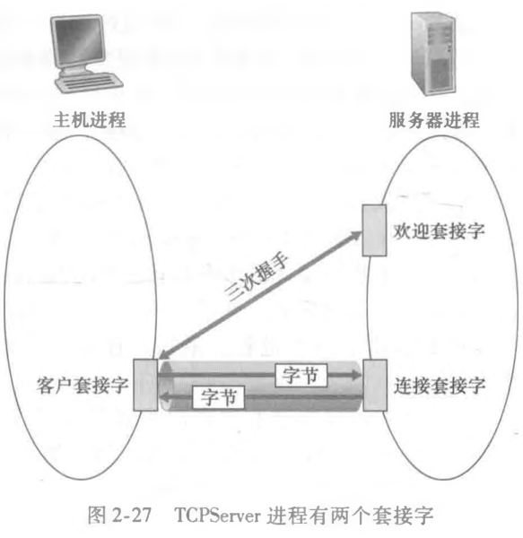

